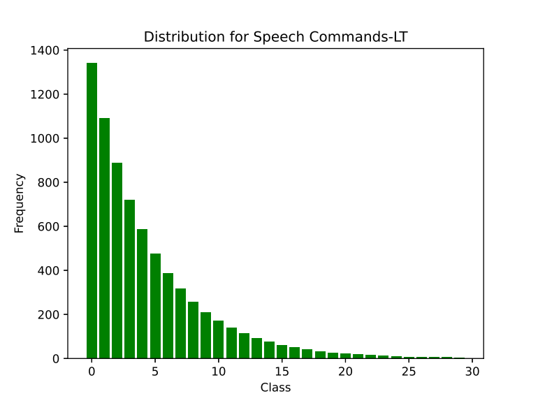

# Speech-Commands-LT
Speech Commands-LT is a long-tailed version of the Speech Commands dataset.

Download the orginal dataset (speech_commands_v0.01) using <a href="https://pytorch.org/audio/main/generated/torchaudio.datasets.SPEECHCOMMANDS.html">Pytorch</a>. Using train, val, and test text files from this repository, filter the original dataset to obtain Speech Commands-LT.

Or, you can download the dataset <a href="https://drive.google.com/file/d/17N-FvC_btw06-Ag0NrrBHanYnRkAA1CW/view?usp=drive_link">here</a>.



If you use this dataset, kindly cite our <a href="https://link.springer.com/article/10.1007/s10489-024-06157-8">work</a>. 🙂
```bibtex
@article{darkwah2025enhancing,
  title={Enhancing few-shot learning using targeted mixup},
  author={Darkwah Jnr, Yaw and Kang, Dae-Ki},
  journal={Applied Intelligence},
  volume={55},
  number={4},
  pages={279},
  year={2025},
  publisher={Springer}
}
```
